```{r setup, include=FALSE}
#devtools::install_github('brunaw/xaringan')
options(htmltools.dir.version = FALSE)
knitr::opts_chunk$set(fig.align = 'center')
auf::packages('tidyverse', 'Bchron', 'ggridges', 'ggforce')
```

class: title-slide, center, middle

<br>

## Improving chronological models for estimating sea-level rise

<br> 

### Andrew C Parnell (+ Andy Kemp, Niamh Cahill, Ben Horton, Roland Gehrels,...)

<br>

### 22nd July 2019

<br>

[andrewcparnell.github.io/palsea_20190722/](andrewcparnell.github.io/palsea_20190722/)
---

class: big

# What's a chronology model?

Usual set up is:
- Have a core
- Some radiocarbon dates with depths
- Know the calibration curve that applies to these dates
- Might know the age of the top of the core (or a constraint on it)
- Might have some other types of dates as well

A chronology model will then give you estimated ages for any depth you choose in the core.

---

# A brief history of chronology models

```{r, echo = FALSE, out.height="500", fig.align='default'}
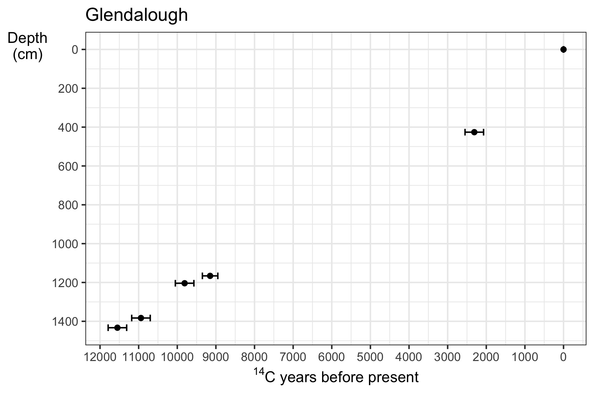
```

---

# A brief history of chronology models

```{r, echo = FALSE, out.height="500", fig.align='default'}
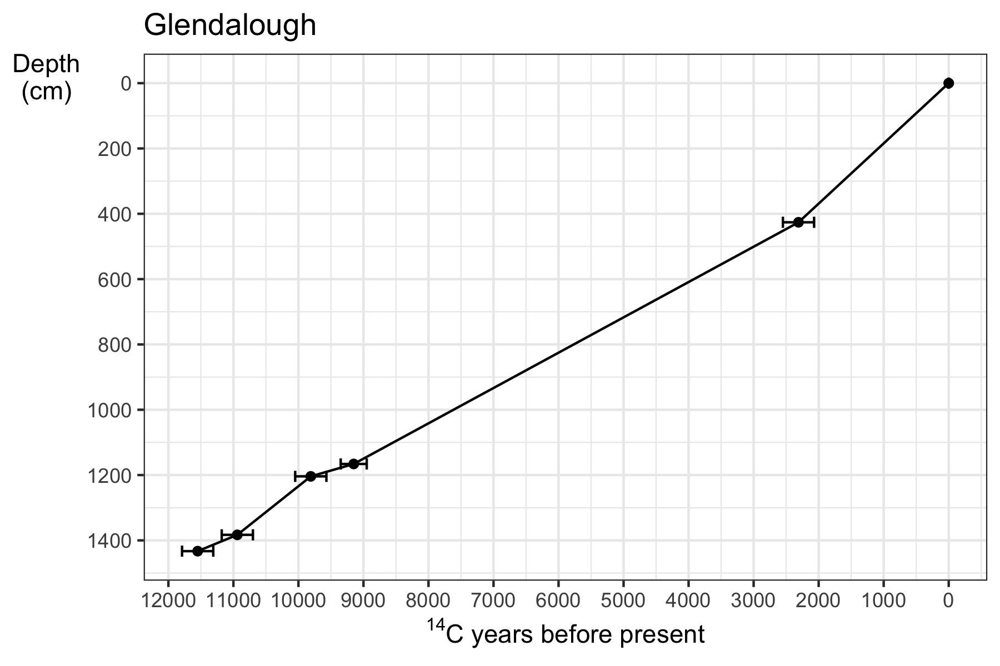
```

---


# A brief history of chronology models

```{r, echo = FALSE, out.height="500", fig.align='default'}
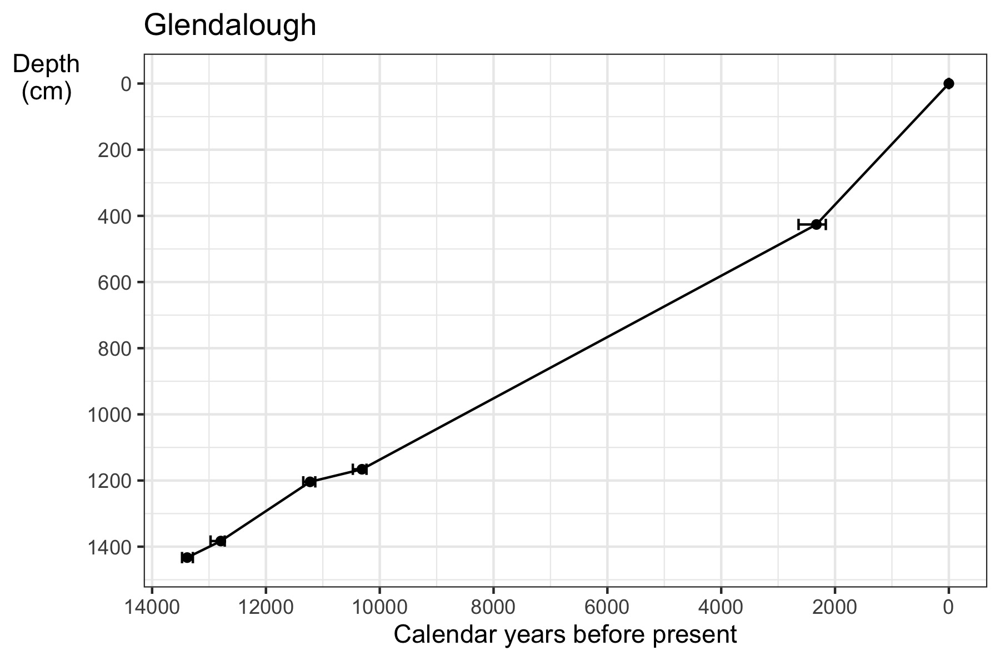
```

---


# A brief history of chronology models

```{r, echo = FALSE, out.height="500", fig.align='default'}
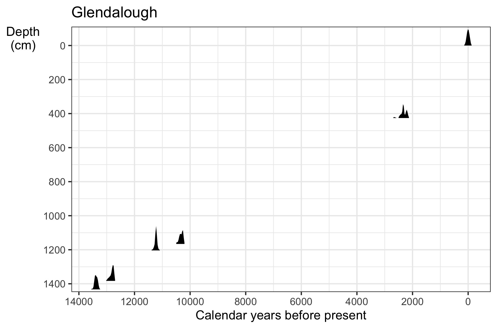
```

---


# A brief history of chronology models

```{r, echo = FALSE, out.height="500", fig.align='default'}
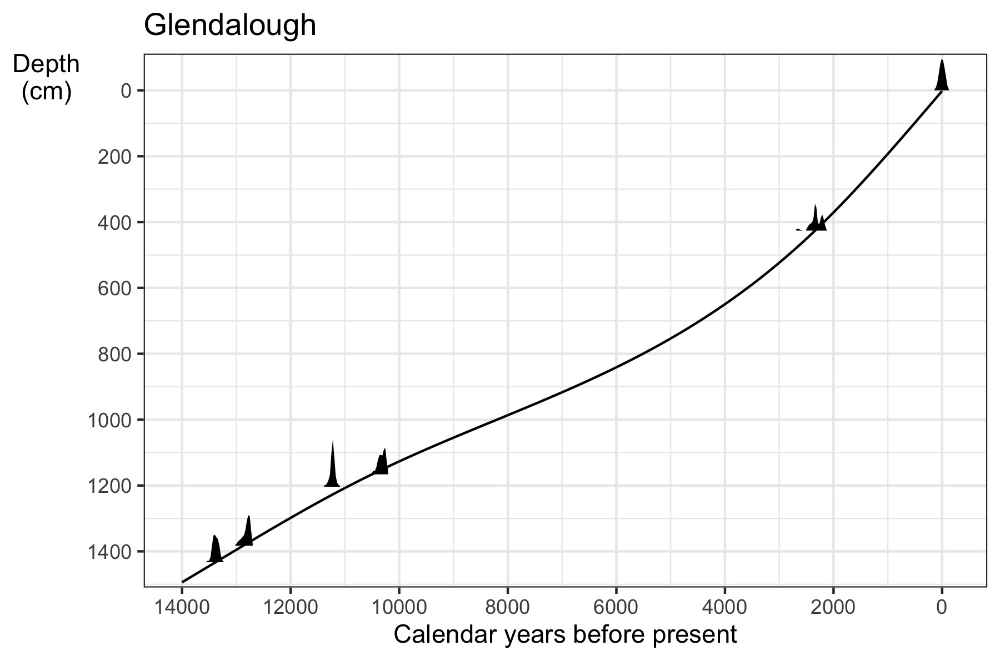
```

---


# A brief history of chronology models

```{r, echo = FALSE, out.height="500", fig.align='default'}
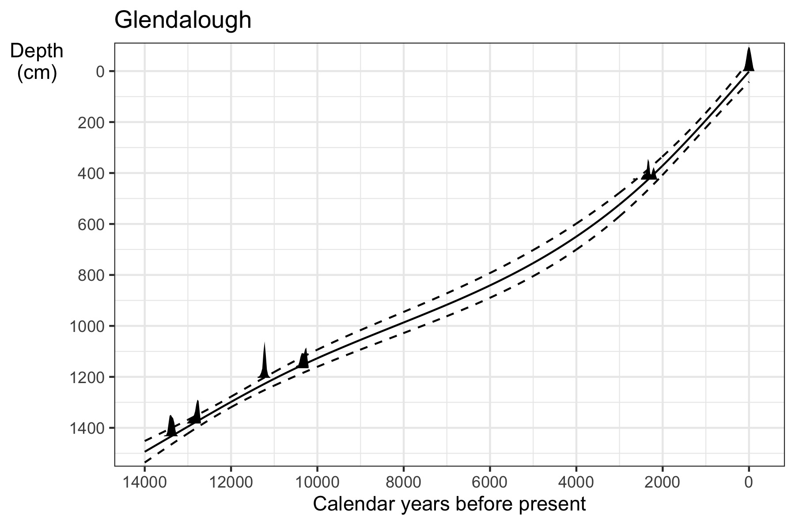
```

---

# Enter Bchron

```{r, echo = FALSE, out.height="500", fig.align='default'}
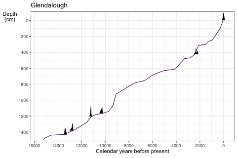
```

---

# Enter Bchron

```{r, echo = FALSE, out.height="500", fig.align='default'}
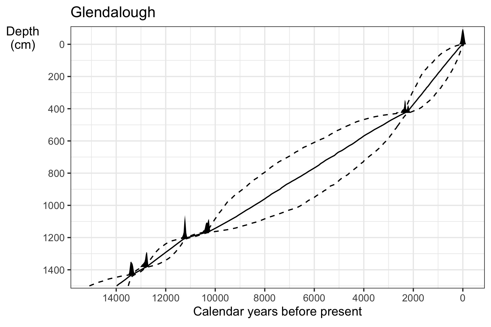
```

---

# Sluggan Moss

```{r, echo = FALSE, out.height="500", fig.align='default'}
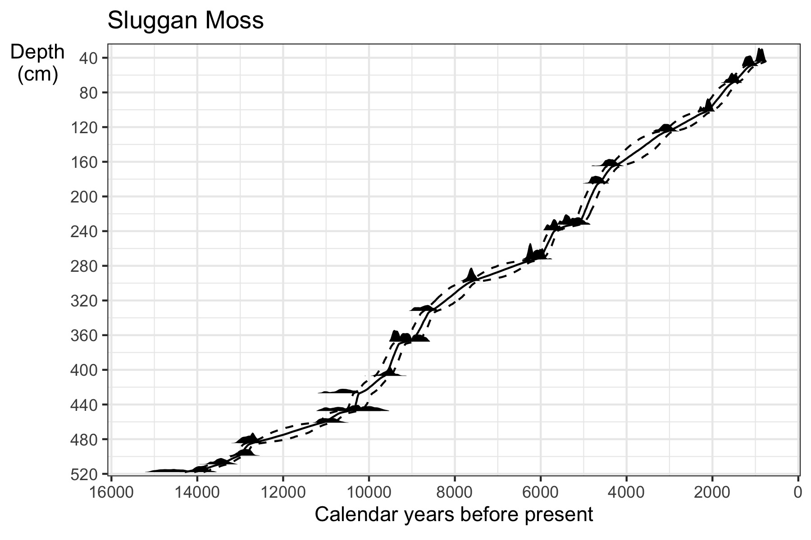
```

---

# New Jersey

```{r, echo = FALSE, fig.align='default'}
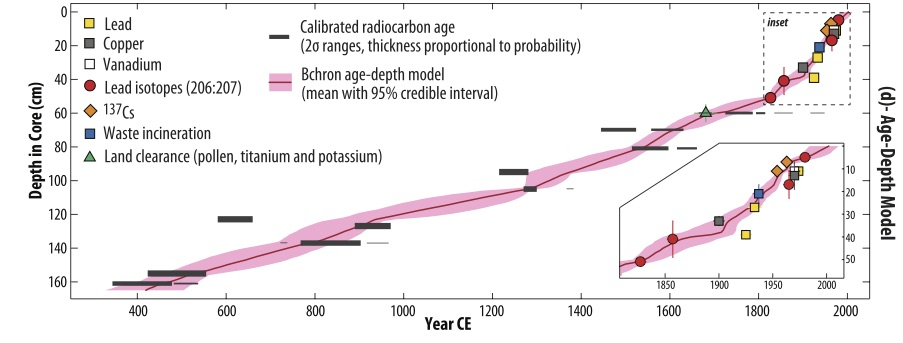
```

---

# Bchron vs **Bacon** vs Oxcal

```{r, echo = FALSE, out.height="500", fig.align='default'}
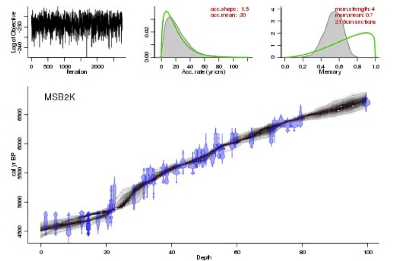
```

---

# Bchron vs Bacon vs **Oxcal**

```{r, echo = FALSE, out.height="500", fig.align='default'}
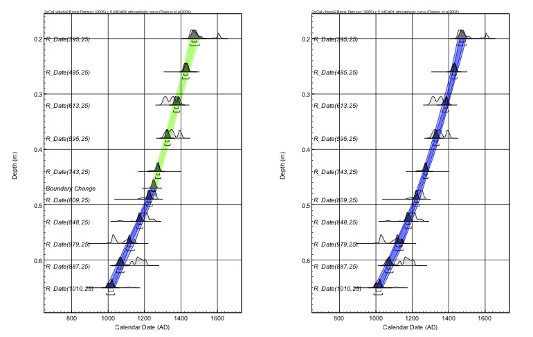
```

---

class: big

# Why should I care which model I use?

- To create a quantitative sea level reconstruction, you need a chronology model which includes uncertainty in its output

- The reconstructions of sea level will be sensitive to the choice of chronology model used

- If you’re using a proper reconstruction method, then the uncertainties will flow through from the chronology into the reconstruction

- If your uncertainties are too small, then the sea level reconstruction will be unrealistically precise and will not stand up to validation

---

class: big

# How to use Bchron

1. Get your data into the right format
1. Run `Bchronology` to get an age-depth model
1. Summarise or plot to get what you need

Everything is open source so you have full access and customization of all output and plots

Some extra features specifically for sea level work

---

class: big

# Bchron demo

```{r}
library(Bchron)
data("Sluggan")
head(Sluggan, 10)
```
```{r, eval = FALSE}
SlugOut = with(Sluggan, 
               Bchronology(ages = ages,
                           ageSds = ageSds, 
                           calCurves = calCurves,
                           positions = position, 
                           positionThicknesses = thickness,
                           ids = id, 
                           predictPositions = seq(44, 518, by = 1)))

```
```{r, include = FALSE}
SlugOut = readRDS(file = 'SlugganChron.rds')
```

---

# Plotting output

```{r, fig.height=5}
plot(SlugOut, dateHeight = 10) + 
  labs(x = 'Age (cal BP)', y = 'Depth (cm)',
       nudgeX = 500)
```

---

class: big

# Extra Bchron features

- Ability to calibrate thousands of dates in seconds

- Obtain sedimentation and accumulation rates (with uncertainties)

- Thickness errors

- Identify influential dates and depths

- Non-parametric phase estimation

- Simple rate and acceleration estimation for RSL data

- User-defined calibration curves

---

# `BchronRSL` demo

```{r}
data("TestRSLData")
head(TestRSLData, 10)
```
```{r, eval = FALSE}
RSLrun = with(TestRSLData, 
              BchronRSL(RSLchron,
                        RSLmean = RSL,
                        RSLsd = Sigma,
                        degree = 3))
```

---

# Plot output of fits

```{r, include = FALSE}
data('TestChronData')
# RSLchron = with(TestChronData, 
#                 Bchronology(ages = ages,
#                             ageSds = ageSds,
#                             positions = position,
#                             positionThicknesses = thickness,
#                             ids = id,
#                             calCurves = calCurves,
#                             jitterPositions = TRUE,
#                             predictPositions = TestRSLData$Depth))
# saveRDS(RSLchron, file = 'RSLChronOut.rds')
RSLChronOut = readRDS(file = 'RSLChronOut.rds')
# RSLrun = with(TestRSLData,
#               BchronRSL(RSLchron,
#                         RSLmean = RSL,
#                         RSLsd = Sigma,
#                         degree = 3))
# saveRDS(RSLrun, file = 'RSLrun.rds')
RSLrun = readRDS(file = 'RSLrun.rds')

```


```{r, fig.height=6, fig.width = 8}
plot(RSLrun, type = 'RSL') + ggtitle('Fitted cubic RSL curve')
```

---

# Plot output of rates

```{r, fig.height=6, fig.width = 8}
plot(RSLrun, type = 'rate') + ggtitle('Rate of RSL change')
```

---

class: big

# What’s next for chronology models?

- Creation of age-depths models for multiple cores with overlapping dating measurements

- Better outlier identification

- Adding in different date formats, e.g. Pb-210

- Creating sea level reconstruction (via e.g. transfer functions) and chronology models simultaneously

- Adding in mechanistic models of sedimentation

**What would other people like?**

---

# Next main job - software

```{r, echo = FALSE, out.height="500", fig.align='default'}
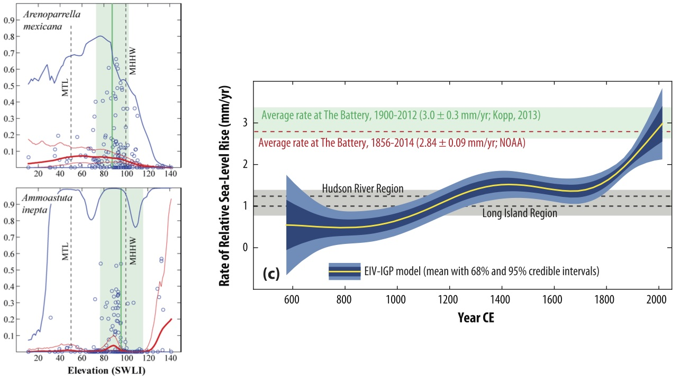
```

---

class: big

# Conclusions

- Chronological models are not simple to build, but there are some good options out there

- Bchron and Bacon are R packages, with open-source code and full scripting capability

- Lots of extra features which may be useful for certain jobs

- Bchron is completely driven by the community and if people want more features then they can request them!

---

class: center, middle

Many thanks to collaborators: Niamh Cahill, John Haslett, Robin Edwards, Ben Horton, Andy Kemp, Roland Gehrels, ...

This work was supported by a Science Foundation Ireland Career Development Award grant 17/CDA/4695 and an SFI Research Centre grant 12/RC/2289_P2

```{r, echo = FALSE, out.height="100"}
knitr::include_graphics("SFI_logo.jpg")
knitr::include_graphics("Insight_logo.jpg")
```


# Questions?

